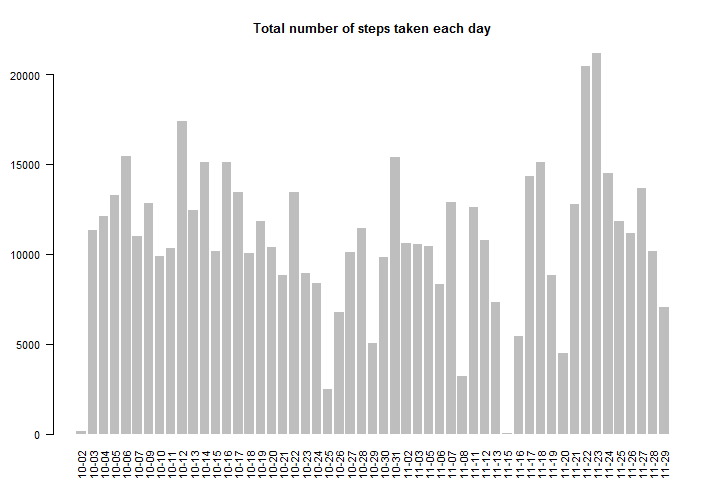
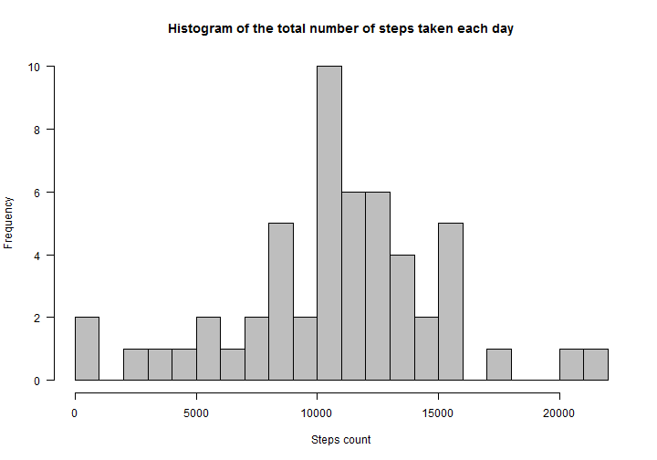

# Reproducible Research: Peer Assessment 1

This assignment makes use of data from a personal activity monitoring device. This device collects data at 5 minute intervals through out the day. The data consists of two months of data from an anonymous individual collected during the months of October and November, 2012 and include the number of steps taken in 5 minute intervals each day.

## Loading and preprocessing the data

Assume that file 'activity.zip' in the current directory.


```r
data <- read.csv(unz("activity.zip", "activity.csv"))
data$date <- as.Date(data$date, format = "%Y-%m-%d")
```


Check the data types:


```r
str(data)
```

```
## 'data.frame':	17568 obs. of  3 variables:
##  $ steps   : int  NA NA NA NA NA NA NA NA NA NA ...
##  $ date    : Date, format: "2012-10-01" "2012-10-01" ...
##  $ interval: int  0 5 10 15 20 25 30 35 40 45 ...
```


## What is mean total number of steps taken per day?


```r
data.total <- aggregate(steps ~ date, data, sum, na.rm = T)

par(las = 2, cex = 0.9)
barplot(data.total$steps, names.arg = format(data.total$date, "%m-%d"), border = F, 
    main = "Total number of steps taken each day")
```

 

```r

par(las = 1, cex = 1)
hist(data.total$steps, breaks = 20, col = "gray", xlab = "Steps count", main = "Histogram of the total number of steps taken each day")
```

 

```r

mean.steps <- mean(data.total$steps, na.rm = T)
median.steps <- median(data.total$steps, na.rm = T)
```


For total number of steps taken per day:
- Mean: **10766.19**
- Median: **10765**

## What is the average daily activity pattern?


```r
data.intervals <- aggregate(steps ~ interval, data, mean, na.rm = T)
plot(data.intervals$interval, data.intervals$steps, type = "l", xlab = "Interval", 
    ylab = "Steps count", main = "Average number of steps taken by interval")
```

 


## Imputing missing values

Dataset contain **17568** rows, **2304** of them contain missing values.

To populate missing values, lets choose to replace them with the mean value at the same interval across days.

Lets create a new dataset **date.complete** that is equal to the original dataset but with the missing data filled in.


```r
data.complete <- data
na.ind <- which(is.na(data.complete$steps), arr.ind = T)
data.complete$steps[na.ind] <- data.intervals$steps[which(data.intervals$interval == 
    data$interval[na.ind])]
```


Plot this dataset:


```r
data.complete.total <- aggregate(steps ~ date, data.complete, sum)

par(las = 2, cex = 0.9)
barplot(data.complete.total$steps, names.arg = format(data.complete.total$date, 
    "%m-%d"), border = F, main = "Total number of steps taken each day")
```

 

```r

par(las = 1, cex = 1)
hist(data.complete.total$steps, breaks = 20, col = "gray", xlab = "Steps count", 
    main = "Histogram of the total number of steps taken each day")
```

 

```r

mean.complete.steps <- mean(data.complete.total$steps)
median.complete.steps <- median(data.complete.total$steps)
```


For total number of steps taken per day:
- Mean: **10766.19**
- Median: **10765.59**

Mean value remains unchanghed, the median value has shifted closer to the mean.

## Are there differences in activity patterns between weekdays and weekends?

Lets split dataset into two subsets and plot them.


```r
Sys.setlocale("LC_TIME", "English")  # Windows
```

```
## [1] "English_United States.1252"
```

```r
data.split <- split(data.complete, weekdays(data.complete$date) %in% c("Saturday", 
    "Sunday"))
names(data.split) <- c("weekday", "weekend")

data.split.intervals <- lapply(data.split, function(d) aggregate(steps ~ interval, 
    d, mean))

for (name in names(data.split.intervals)) {
    plot(data.split.intervals[[name]]$interval, data.split.intervals[[name]]$steps, 
        type = "l", xlab = "Interval", ylab = "Steps count", main = paste("Average number of steps taken by interval in", 
            name))
}
```

  


We observe that there are a lot of activity at the beginig of the weekday, probably connected with the commuting to work or jogging, on weekend activity is more spread out.
